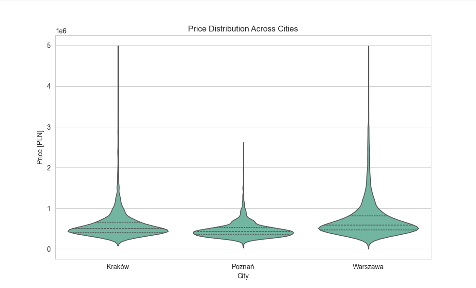
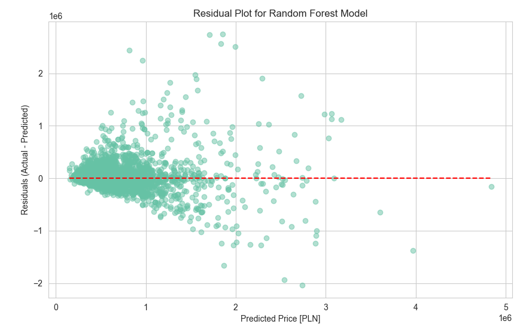
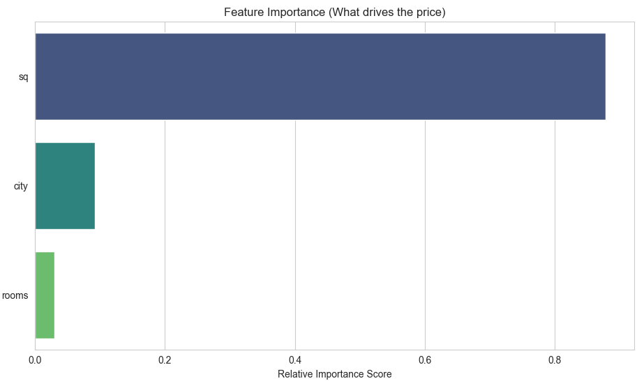

## Real Estate Price Analysis in Poland-using R/python

This educational project performs an advanced data analysis and machine learning study on Polish housing prices, demonstrating proficiency in **Python**  and **R**.
To build a robust predictive model and derive actionable insights into the primary factors driving real estate prices in major Polish cities.

## Key Visual Insights 

The initial analysis revealed strong linear relationships between the log-transformed price and area, and clear price differences across cities.

### 1. Relationship Between Log(Price) and Area

### 2. Price Distribution Across Cities

### 3. Model Residual Analysis

---

##  Model Performance & Feature Importance

The project utilized the **Random Forest Regressor** due to its superior performance on complex, non-linear market data. The final model analysis provides clear insights into price drivers.

### 3. Model Performance and Feature Importance

This combined visual report summarizes the model's accuracy and identifies the most influential variables.

##

**Key Insight:** The model confirms that **Area [sq m]** is the primary driver of price, followed by **City**, while the number of rooms has a relatively minor impact.

## Final Prediction

| Feature | Value |
|:---|:---|
| Predicted Price (PLN) | ~578,438 |
| R-squared (R²) | ~0.68 |
---
### python:
pandas
numpy
matplotlib
seaborn
scikit-learn
### R:
tidyverse
randomForest
caret
reshape2

